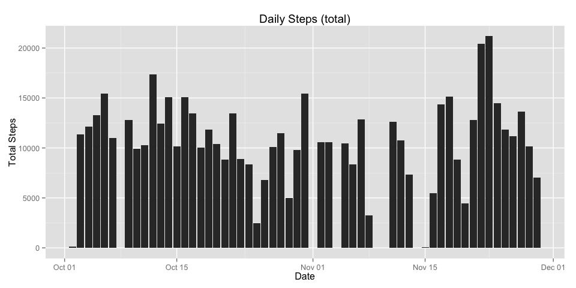
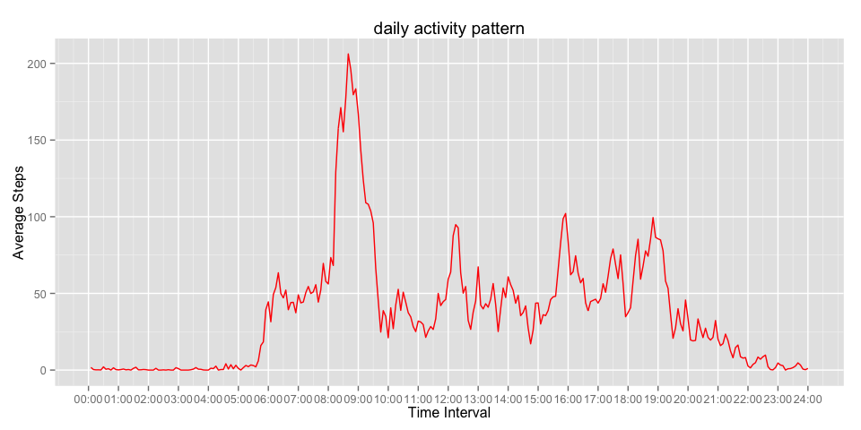
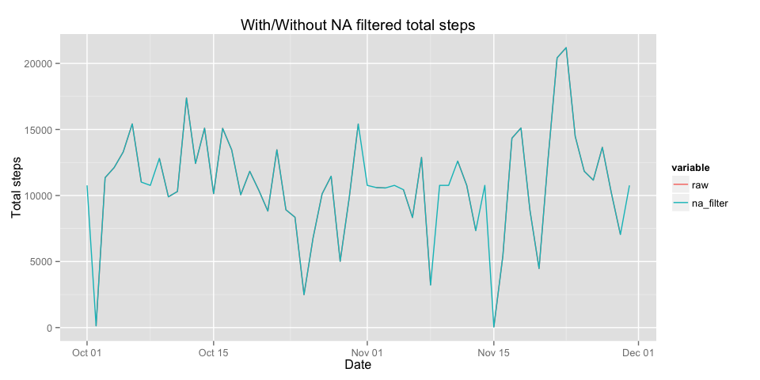
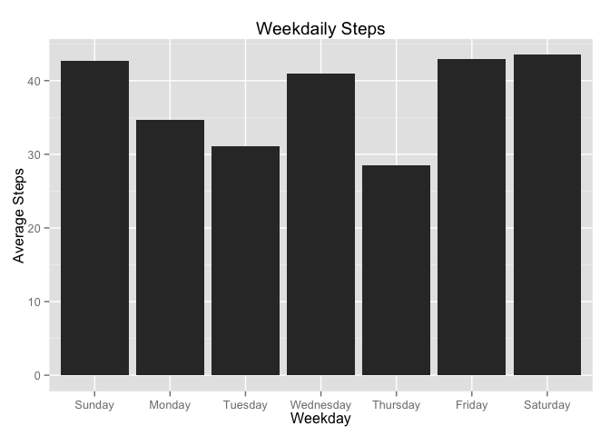
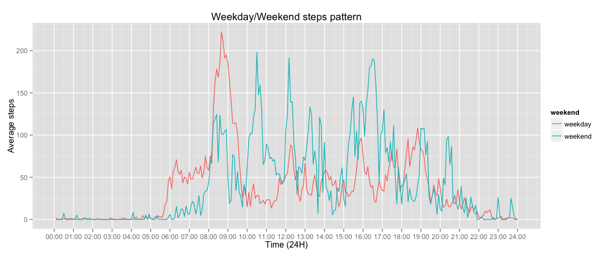

# Reproducible Research: Peer Assessment 1


## Loading and preprocessing the data
Data loading


```r
activity_raw<-read.csv('activity.csv')
```

Data Preprocessing:  
Changing date and time to POSIX class


```r
activity_raw$date<-as.POSIXct(activity_raw$date)
activity_raw$interval<-sprintf('%04.0f',activity_raw$interval)
activity_raw$interval<-factor(paste(substr(activity_raw$interval,0,2),substr(activity_raw$interval,3,4),sep=':'))
activity_raw$time<-as.POSIXct(paste(activity_raw$date,activity_raw$interval,sep = ' '))
```

## What is mean total number of steps taken per day?


```r
library(dplyr)
```

```r
activity_date<-group_by(activity_raw,date)
date_mean<-summarise(activity_date,steps=mean(steps))
head(date_mean)
```

```
## Source: local data frame [6 x 2]
## 
##         date   steps
## 1 2012-10-01      NA
## 2 2012-10-02  0.4375
## 3 2012-10-03 39.4167
## 4 2012-10-04 42.0694
## 5 2012-10-05 46.1597
## 6 2012-10-06 53.5417
```

```r
date_median<-summarise(activity_date,steps=median(steps))
head(date_median)
```

```
## Source: local data frame [6 x 2]
## 
##         date steps
## 1 2012-10-01    NA
## 2 2012-10-02     0
## 3 2012-10-03     0
## 4 2012-10-04     0
## 5 2012-10-05     0
## 6 2012-10-06     0
```


```r
library(ggplot2)
```

```r
date_total<-summarise(activity_date,steps=sum(steps))
ggplot(date_total)+geom_bar(aes(x=date,y=steps),stat = 'identity')+xlab('Date')+ylab('Total Steps')+ggtitle('Daily Steps (total)')
```

 


## What is the average daily activity pattern?


```r
activity_interval<-group_by(activity_raw,interval)
interval_mean<-summarise(activity_interval,steps=mean(steps,na.rm = T))
ggplot(interval_mean,aes(x=interval,y=steps))+geom_line(aes(x=as.integer(interval)),color='red')+xlab('Time Interval')+ylab('Average Steps')+ggtitle('daily activity pattern')+scale_x_continuous(breaks = seq(0,288,12),label=c(paste(sprintf('%02.0f',0:24),'00',sep=':')))
```

 

```r
interval_mean[which.max(interval_mean$steps),]
```

```
## Source: local data frame [1 x 2]
## 
##     interval steps
## 104    08:35 206.2
```


## Imputing missing values


```r
all_day_na<-summarise(activity_date,all_na= length(steps)==sum(is.na(steps)))
missed_day<-all_day_na$date[all_day_na$all_na]
s<-activity_raw$date %in% missed_day
activity_na_filled<-activity_raw
activity_na_filled[s,]$steps<-rep(interval_mean$steps,8)
```


```r
library(reshape)
```


```r
compare_raw_nafiltered<-data.frame(activity_raw$date,activity_date$steps,activity_na_filled$steps)
colnames(compare_raw_nafiltered)<-c('date','raw','na_filter')
compare_raw_nafiltered_grouped<-group_by(compare_raw_nafiltered,date)
compare_date<-summarise(compare_raw_nafiltered_grouped,raw=sum(raw),na_filter=sum(na_filter))
ggplot(melt(compare_date,'date'))+geom_line(aes(x=date,y=value,colour=variable))+xlab('Date')+ylab('Total steps')+ggtitle('With/Without NA filtered total steps')
```

 


## Are there differences in activity patterns between weekdays and weekends?


```r
activity_raw$weekday<-weekdays(activity_raw$date)
activity_raw$weekday<-factor(activity_raw$weekday,levels=c('Sunday','Monday','Tuesday','Wednesday','Thursday','Friday','Saturday'))
activity_raw$weekend<-factor(!as.numeric(activity_raw$weekday) %in% seq(2,7))
levels(activity_raw$weekend)<-c('weekday','weekend')

activity_week<-group_by(activity_raw,weekday)
week_mean<-summarise(activity_week,steps=mean(steps,na.rm=T))
week_mean<-week_mean[c(2,6,7,5,1,3,4),]
ggplot(week_mean)+geom_bar(aes(x=weekday,y=steps),stat = 'identity')+xlab('Weekday')+ylab('Average Steps')+ggtitle('Weekdaily Steps')
```

 

```r
activity_weekend<-group_by(activity_raw,weekend,interval)
weekend_interval<-summarise(activity_weekend,steps=mean(steps,na.rm = T))
ggplot(weekend_interval,aes(y=steps))+geom_line(aes(x=as.integer(interval),colour=weekend))+scale_x_continuous(breaks = seq(0,288,12),label=c(paste(sprintf('%02.0f',0:24),'00',sep=':')))+ylab('Average steps')+xlab('Time (24H)')+ggtitle('Weekday/Weekend steps pattern')
```

 

